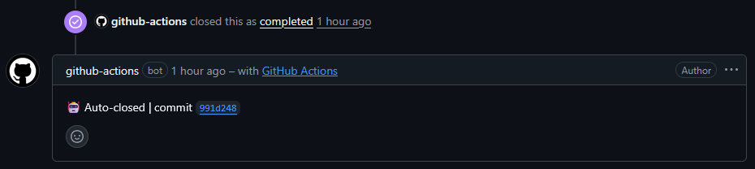
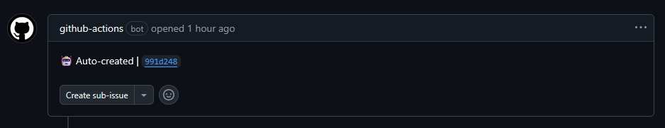

<div align="center">


</div>

---

# Welcome to Issues Manager Workflow

The **Issues Manager** workflow automatically closes and creates GitHub Issues based on keywords in commit messages. It runs on **all branches/or definded branches** and for **all pull requests/or pull requests actions**.


# 🚀 Quickstart

Create `.github/workflows/issues-manager.yml` → Done! 🎉


# ✨ Features

- **Close issues** with keywords like `close`, `fix`, `resolve`,...
- **Create issues** with keywords like `todo:`, `bug`, `new issue`,...
- **Multiple issues** close or create simultaneously
- **Works everywhere**: On all branches and in pull requests
- **Automatic labels** for new issues


# 🔧 Closing Issues


**Supported Keywords:**
```
close, fix, resolve
schließen, beheben, lösen
```

**Examples:**

Close a single issue:
```bash
git commit -m "fix: #42 Fixed login bug"
git commit -m "close #15"
git commit -m "resolve: Fixed API error #8"
```

Close multiple issues:
```bash
git commit -m "fix #1, #2, #3 - Multiple bugs"
git commit -m "close #5 and #6"
```

**What happens?**

1. Issue is set to `closed`
2. Automatic comment is added: `🤖 Auto-closed | commit abc1234`


# 🆕 Creating Issues


**Supported Keywords:**

| Keyword     | Label  | Example                      |
|-------------|--------|------------------------------|
| `todo:`     | `todo` | `todo: Write tests`          |
| `bug`       | `bug`  | `bug: Memory leak`           |
| `new issue` | -      | `new issue: Feature XYZ`     |
| `n-iss`     | -      | `n-iss: Missing docs`        |

**Examples:**

Create a simple issue:
```bash
git commit -m "todo: Add unit tests"
git commit -m "bug: Dashboard loads slowly"
git commit -m "new issue: Code review"
git commit -m "n-iss: Refactoring needed"
```

**What happens?**

1. New issue is created
2. Title: Text after the keyword
3. Body: `🤖 Auto-created | commit abc1234`
4. Label: According to the keyword


# ⚙️ Customization

### **Workflow file:**

```
.github/workflows/issues-manager.yml
```


### **Add keywords:**

**CLOSE keywords**
*Edit lines 37-40:*

```javascript
const closeKeywords = [
  'close', 'fix', 'resolve',
  'schließen', 'beheben', 'lösen' // ← add new keywords here
];
```

**CREATE keywords**
*Edit lines 43-49:*

```javascript
const createKeywords = [
  { keyword: 'todo:', label: 'todo' },
  { keyword: 'bug', label: 'bug' },
  { keyword: 'new issue', label: null },
  { keyword: 'n-iss', label: null },
  // ← Add new ones here
];
```

**Format:**
- `keyword`: The keyword (case-insensitive)
- `label`: Label name or `null` (← must be defined in = **github.com/user-xyz/your-repo/labels**)

---

### **Adjust triggers:**

**Only** specific branches:
```yaml
on:
  push:
    branches:
      - main
      - develop
```

**Only** pull requests:
```yaml
on:
  pull_request:
    types: [opened, synchronize, closed]
```


# 📄 License & Copyright

<div align="center">

**All Rights Reserved**

<br>

**License Terms:**

✅ You may edit and modify this workflow  
❌ No commercial use allowed  
❌ Do not claim this as your own work  

<br>

*This workflow is provided "as-is" without warranty of any kind.*

---

**Made with 💻 and ☕**  
*V 1.0*

© 2026 [**dev-mb.dev**](https://dev-mb.dev)

</div>


